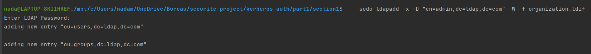
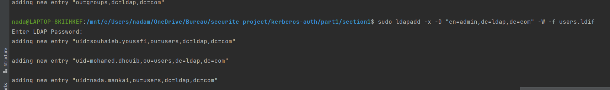
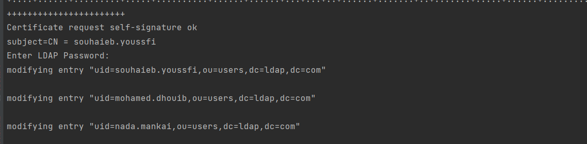
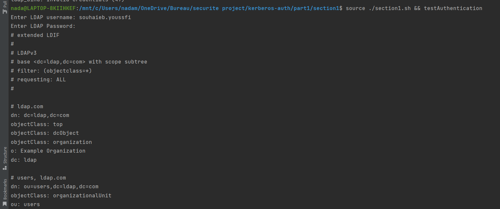
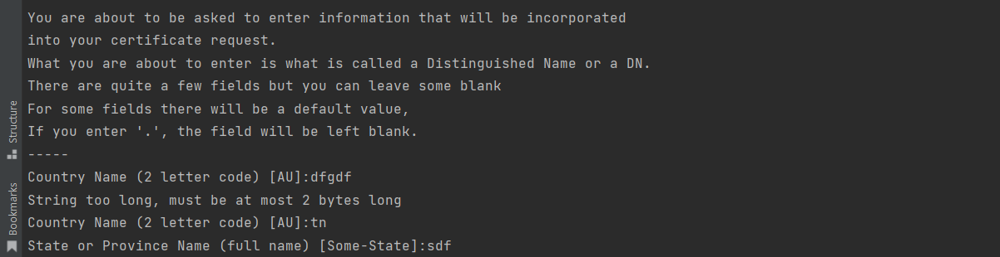

# README: OpenLDAP Configuration Script

## Introduction

This Bash script automates the configuration of OpenLDAP . The script provides functions for installing OpenLDAP, reconfiguring it, adding organizational units and users, managing certificates, testing authentication, configuring LDAPS, and testing secure LDAP with LDAPS.

## Functions

### 1. installOpenLDAP

This function installs OpenLDAP and LDAP utilities on the system.

~~~sh
source ./section1.sh && installOpenLDAP
   ~~~

### 2. reconfigureOpenLDAP
   This function reconfigures OpenLDAP, allowing for the modification of its settings.
~~~sh
source ./section1.sh && reconfigureOpenLDAP
 ~~~

### 3. addOpenLDAPOrganizationalUnits
   This function adds Organizational Units to OpenLDAP based on the provided organization.ldif file.
   ~~~sh
source ./section1.sh && addOpenLDAPOrganizationalUnits
 ~~~

### 4. addOpenLDAPUsers
   This function adds users to OpenLDAP based on the provided users.ldif file.

   ~~~sh
source ./section1.sh && addOpenLDAPOrganizationalUnits
 ~~~

### 5. addCertificates
The addCertificates function generates Certificate Authority (CA), user keys, and certificates for OpenLDAP users. It reads user names from the user_list.txt file and creates certificates accordingly.
   ~~~sh
source ./section1.sh && addCertificates
 ~~~

### 7. testAuthentication
   The testAuthentication function prompts the user to input an LDAP username and tests the user's authentication in OpenLDAP using ldapsearch.
   ~~~sh
   source ./section1.sh && testAuthentication
 ~~~

### 8. configureLDAPS
   The configureLDAPS function sets up LDAP over TLS (LDAPS) by generating a private key and a self-signed certificate. It configures the LDAP server to use the certificate and restarts the service.

   ~~~sh
source ./section1.sh && configureLDAPS
 ~~~

### 9. testLDAPS
   The testLDAPS function tests secure LDAP with LDAPS by prompting the user for an LDAP username or accepting it as an argument. It performs an ldapsearch over LDAPS to validate secure access.

   ~~~sh
source ./section1.sh && testLDAPS
 ~~~