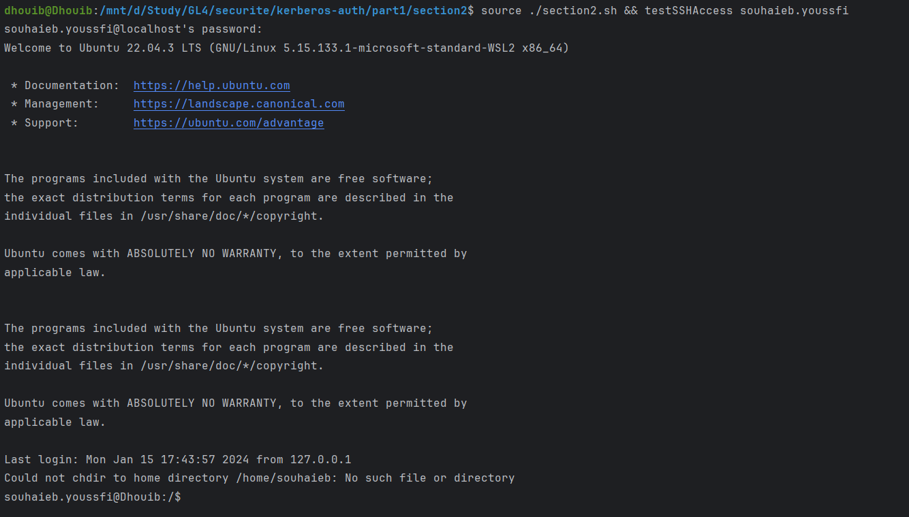
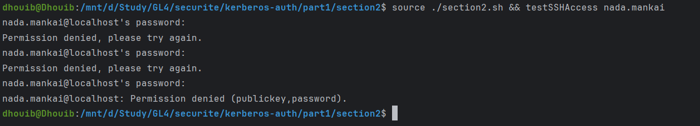

# **Section 2: Integration of SSH**

## **Introduction**
This section provides a step-by-step guide for integrating SSH authentication via OpenLDAP.  Follow these instructions to enable SSH authentication, restrict SSH access to a specific OpenLDAP group, and perform tests for authorized and unauthorized SSH access.

## **Using the Script**

___Step 1: Enable SSH Authentication via OpenLDAP___ 
Run the following command to enable SSH authentication via OpenLDAP:

~~~sh
sh enableSSHAuthWithOpenLDAP
~~~
This function installs openssh-server, libpam-ldapd, and nscd, and then reconfigures libpam-ldapd.

___Step 2: Restrict SSH Access to a Specific OpenLDAP Group___ 
Execute the following command to give SSH access only to authorized users:

~~~sh
sh restrictSSHAccess
~~~
This function allow only users in the 'teachers' group and restarts the SSH service.

___Step 3: Test SSH Access___ 
This function prompts for the LDAP username if not provided as an argument and attempts an SSH connection to localhost. 
Run the following command to test SSH access for both authorized and unauthorized users:

~~~sh
sh testSSHAccess
~~~
If you want to test for a specific user, provide the LDAP username as an argument:

~~~sh
sh testSSHAccess <LDAP_USERNAME>
~~~

We can test web access for the user "souhaieb.youssfi" with the password "souheib". This user is allowed based on the LDAP configuration since he is in the teachers group.

~~~sh
sh testSSHAccess souhaieb.youssfi
~~~
You should see a successful response indicating that the SSH access is granted for the authorized user.

Test SSH access for a user who is not authorized. Replace the command with credentials for a user who is not in the allowed LDAP group.
For example run this command :

~~~sh
sh testSSHAccess nada.mankai
~~~

In this case, the SSH access should not be granted since this user is not a teacher.