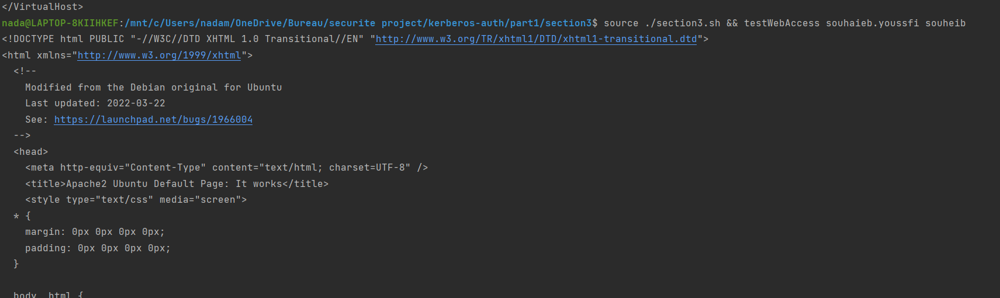
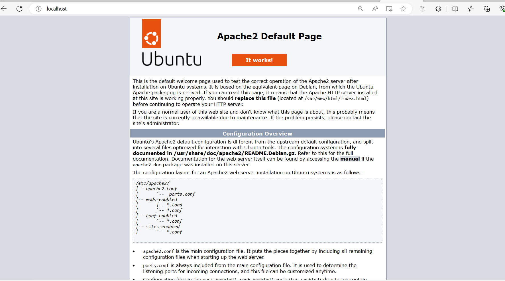

# **README: Integration of Apache with OpenLDAP**

## **Introduction**

This Bash script aims to automate the integration of Apache with OpenLDAP authentication . The process involves installing Apache, configuring Apache for OpenLDAP authentication, and testing web access for authorized and unauthorized users.

## **Using the Script**
___1.Install Apache and required modules :___

The first script function installs Apache and necessary modules. Execute the following command to initiate the installation:
~~~sh
  source ./section3/section3.sh && installApache
   ~~~

___2.Configure Apache for OpenLDAP authentication :___

The second script function configures Apache for OpenLDAP authentication. Ensure you have an apache.conf file with the appropriate configuration before running this function. Execute the following command to perform the configuration:
~~~sh
  source ./section3.sh && configureApacheOpenLDAP
   ~~~

___3.Test web access :___

The third script function tests web access for an authorized and unauthorized user. Use the following command, replacing username and password with valid information:
~~~sh
 source ./section3.sh && testWebAccess souhaieb.youssfi souheib
   ~~~
This command sources the script and then tests web access for the user "souhaieb.youssfi" with the password "souheib". This user is allowed based on the LDAP configuration.

You should see a successful response indicating that the web access is granted for the authorized user.

Test web access for a user who is not authorized. Replace the command with credentials for a user who is not in the allowed LDAP group.For example run this command :
~~~sh
 source ./section3.sh && testWebAccess nada.mankai mankai
  ~~~

In this case, the web access should not be granted, and you should receive an authentication error or access denied message.