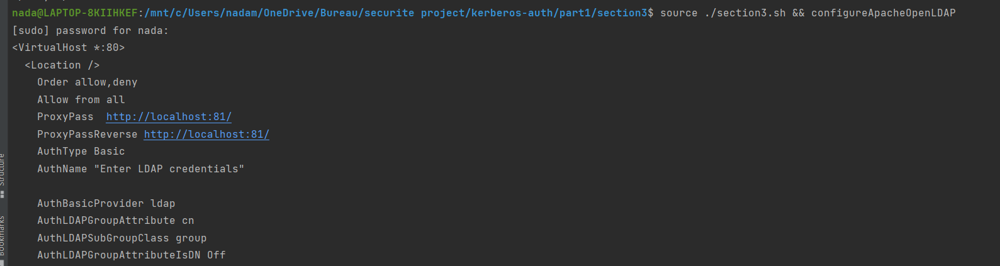
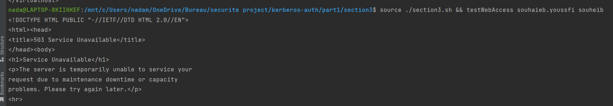
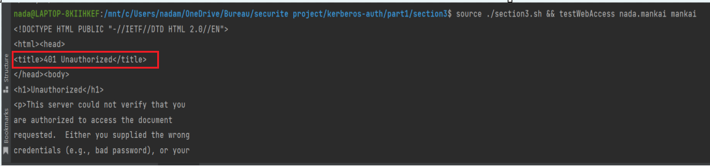

# **Section 3: Integration of Apache with OpenLDAP**

## **Introduction**

This Bash script aims to automate the integration of Apache with OpenLDAP authentication .   
The process involves installing Apache, configuring Apache for OpenLDAP authentication, and testing web access for authorized and unauthorized users.

## **Using the Script**
___1.Install Apache and required modules :___

The first script function installs Apache and necessary modules.  Execute the following command to initiate the installation:
~~~sh
  source ./section3/section3.sh && installApache
~~~

___2.Configure Apache for OpenLDAP authentication :___

The second script function configures Apache for OpenLDAP authentication.  Execute the following command to perform the configuration:
~~~sh
  source ./section3.sh && configureApacheOpenLDAP
   ~~~

This configuration will allow access to the website for users in the "teachers" group.  You can change the access rights in the apache.conf file to allow access for a different group.

___3.Test web access :___

The third script function tests web access for an authorized and unauthorized user. 
~~~sh
 source ./section3.sh && testWebAccess
   ~~~
If you want to test for a specific user, provide the LDAP username as an argument:
~~~sh
 source ./section3.sh && testWebAccess <LDAP_USERNAME>
   ~~~

We can test web access for the user "souhaieb.youssfi" with the password "souheib". This user is allowed based on the LDAP configuration since he is in the teachers group.
~~~sh
 source ./section3.sh && testWebAccess souhaieb.youssfi
   ~~~

You should see a successful response indicating that the web access is granted for the authorized user.

Test web access for a user who is not authorized. Replace the command with credentials for a user who is not in the allowed LDAP group.
For example run this command :
~~~sh
 source ./section3.sh && testWebAccess nada.mankai
  ~~~

In this case, the web access should not be granted since this user is not a teacher,

_Creating Your Own Website_

If you wish to create your own website using Apache with OpenLDAP integration, this script serves as a solid foundation.  Simply follow the provided steps for Apache configuration and LDAP integration, and you'll have a secure authentication system in place for your site.  Please note that the web access testing in this script uses placeholder credentials, and the actual website content is not provided.  You are encouraged to develop and deploy your unique website content, taking advantage of the secured authentication setup.
