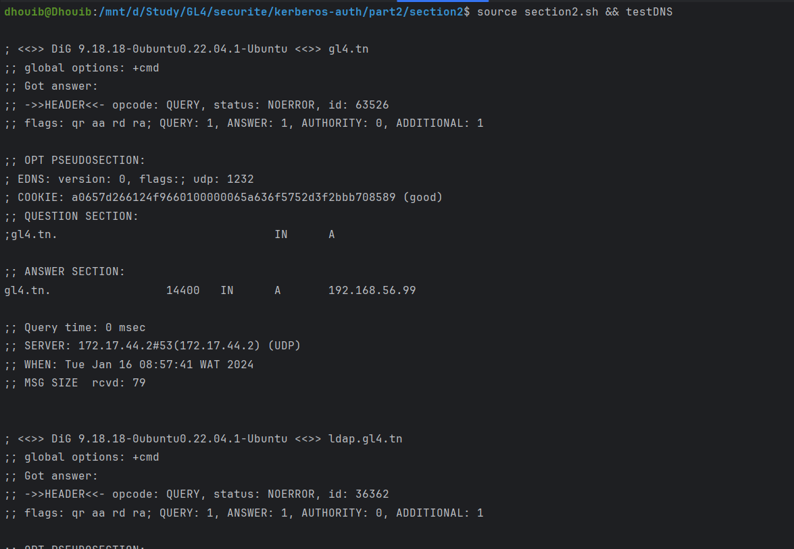

# Section 1: Configuration of DNS Server
 ### 1.1 Install Bind9
~~~sh
  source ./section1.sh && installBind9
~~~
 ### 1.2 Create DNS Zone Files
  Modify the IP addresses in the gl4.tn.zone file to match your network configuration.
  Optionally, modify the IP address in the db.99.56.168.192 file for reverse DNS lookup. 
 ~~~sh 
  source ./section1.sh && createZoneFiles
  ~~~
 ### Optional: Set up reverse zone file 
~~~sh
    source ./section1.sh && createReverseZoneFile
~~~
 ### 1.3 Update Main Configuration Files
 Copy the provided named.conf.local and named.conf.options files to the Bind configuration directory:
    ~~~sh
        source ./section1.sh && updateMainConfigFiles
    ~~~
  
 ### 1.4 Check Configuration Files
Ensure the correctness of the configuration files:
~~~sh
  source ./section1.sh && checkConfigFiles
~~~~
 ### 1.5 Verify DNS Zone File
Verify the syntax of the DNS zone file:
~~~sh
    source ./section1.sh && verifyZoneFile
~~~~
 ### 1.6 Restart Bind9
 Restart the Bind9 service to apply the changes:
~~~sh
    source ./section1.sh && restartBind9
~~~~

 ### 1.7 Verify Resolution
  ~~~sh
    source ./section1.sh && testDNS
  ~~~~

