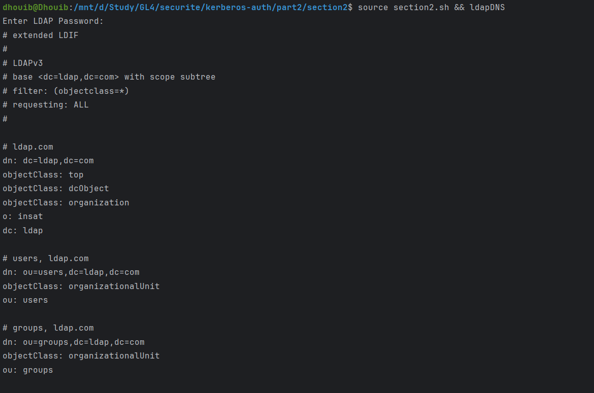
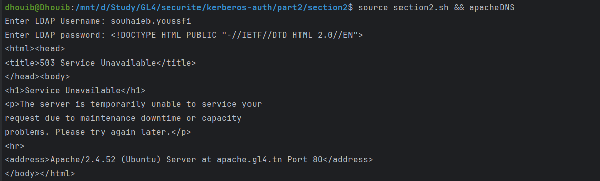
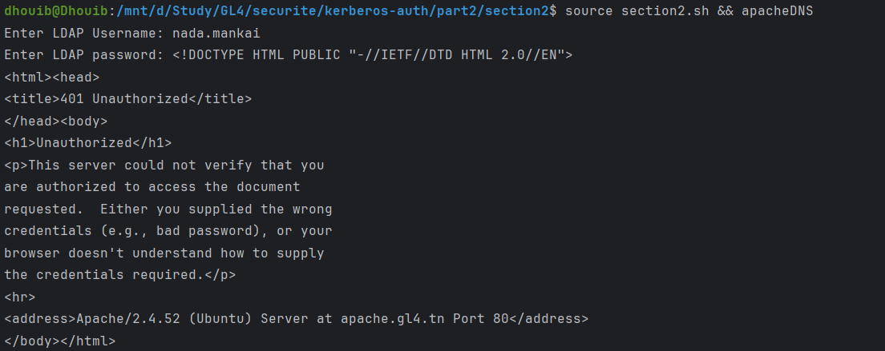
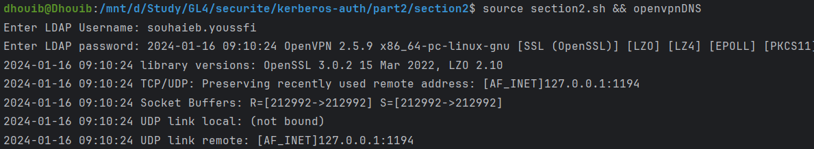

# Section 2: Validation and Testing
### 2.1 Test DNS Resolution
Test DNS resolution for the configured services:

    dig gl4.tn
    dig ldap.gl4.tn
    dig apache.gl4.tn
    dig openvpn.gl4.tn

### Example: ldap auth
~~~sh
  source ./section2.sh && ldapDNS
~~~

### Example: apache auth
~~~sh
  source ./section2.sh && apacheDNS
~~~~

### Example: openvpn auth
~~~sh
  source ./section2.sh && openvpnDNS
~~~

