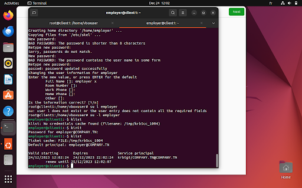

# Kerberos Client and OpenSSH Configuration

This set of scripts is designed to help you configure a Kerberos client and OpenSSH on a Debian-based machine. The scripts aim to set up a client machine with the hostname `client.company.tn` and configure Kerberos user authentication along with OpenSSH.

## Steps and Explanation

### Step 1: Configure Hostname

- **Code:**
  ```bash
  source ./kerberos-client.sh && configureHostname
***Explanation***:
Edit the /etc/hosts file to add the hostname entries.
Set the static hostname to client.company.tn.
Add the hostname kdc.company.tn for the server host.
### Step 2: Install Kerberos Components
- **Code:**
  ```bash
    source ./kerberos-client.sh && installKerberos
***Explanation***:
Update package information using sudo apt-get update.
Install the Kerberos components for the client machine.
### Step 3: Install OpenSSH Server
Code:
- **Code:**
  ```bash
    source ./kerberos-client.sh && installOpenSSH
***Explanation***:
Update package information.
Install the OpenSSH server.
Uncomment and set GSSAPIAuthentication and GSSAPICleanUpCreadentials to yes in SSH configuration files.
Restart the SSH service.

### Step 4: Login and Obtain TGT
- **Code:**
  ```bash
    source ./kerberos-client.sh && login
***Explanation***:
Login and obtain the Ticket Granting Ticket (TGT) using Kerberos.
Display the list of Kerberos tickets.

### Step 5: Receive File Using SCP
Code:
- **Code:**
  ```bash
    source ./kerberos-client.sh && receiveFile
***Explanation***:
Use scp to securely copy a file from the Kerberos server (kdc.company.tn) to the client machine.

***Instructions***
Uncomment and execute the desired steps in the script to perform specific tasks. Follow the comments within the script for additional configuration steps. Adapt the script according to your specific environment and requirements.
